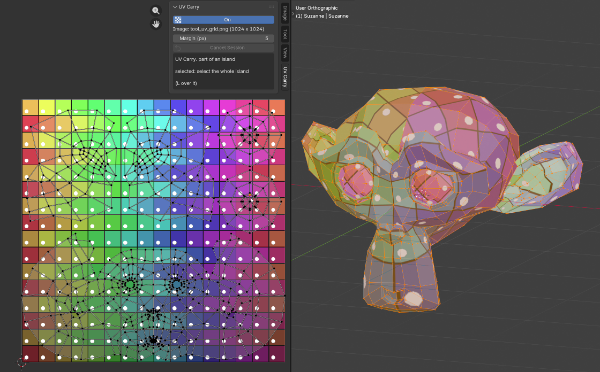
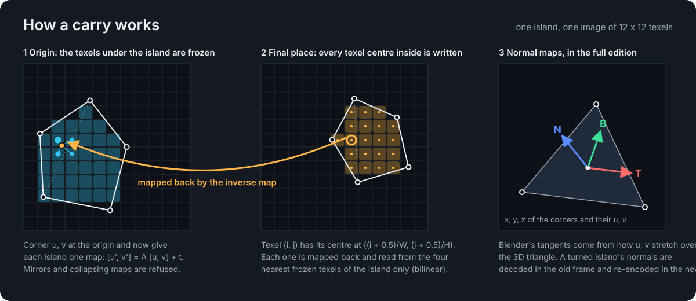

# UV Carry Lite

**Move UVs. Carry Textures.**

A free Blender 5.1 add-on: move, rotate or scale UV islands with Blender's own G, R and S, press `Ctrl+Enter`, and the texture follows them.

  
   
  <a href="https://github.com/user-attachments/assets/ccae296d-47ee-481e-8287-83b9d082a059"><b>▶ Watch the demo</b></a> (12 seconds, with sound)

  
  
  
  

- **Your tools stay yours.** G, R and S are Blender's. Nothing is written while you move; the texture work happens once, at `Ctrl+Enter`.
- **Every image of the material**: colour, packed channels and alpha follow the islands.
- **Several islands at once**, each under its own move. `Ctrl+Enter` with no move pads the selected islands instead.
- **Undo and save.** `Ctrl+Z` restores the texels and the UVs together; Save Carried Images writes the changed images, after a backup of each file.
- **Nothing silent.** What cannot be carried is refused before anything is written, with a message that says why.

## Install

1. Download `uv_carry_lite-<version>.zip` from [Releases](https://github.com/ghbanck/UV-Carry-Lite/releases/latest).
2. In Blender 5.1, open Edit > Preferences > Get Extensions, open the menu at the top right, choose Install from Disk and pick the zip.

## Quick start

1. In the 3D View, select the mesh and press Tab for Edit Mode: the UV editor shows its UVs.
2. In the UV editor, press **UV Carry** in the header, or N > UV Carry > On.
3. Select complete UV islands: L over each, or A for all.
4. Move, rotate or scale them with G, R and S.
5. Press `Ctrl+Enter` over the UV editor: the texture follows the islands.
6. Save Carried Images, in the UV Carry panel, writes the changed images to disk.

The full guide is [uv_carry/USAGE.md](uv_carry/USAGE.md).

## How it works

UV Carry remembers where the islands started, lets Blender move them as it always does, and at `Ctrl+Enter` carries each island's texels from where it started to where it ended. A move by whole texels is copied bit for bit; rotations and scales are resampled from the island's own texels only, so nothing bleeds in from a neighbour.

## UV Carry Lite and UV Carry

UV Carry Lite carries the images of each island's own materials, without normal maps. **UV Carry**, the paid edition, adds tangent-space normal maps, Pack Islands, and Carry Into, which merges the islands of many materials into one atlas.

## Requirements

Blender 5.1. Tested with Blender 5.1.1 on Windows 11.

## License

Copyright (C) 2026 Gustavo Banck. UV Carry Lite is free, licensed under the GNU General Public License, version 3 or any later version: see [LICENSE](LICENSE).
